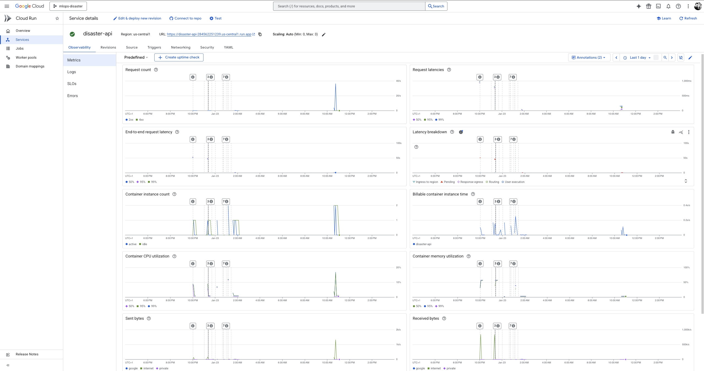
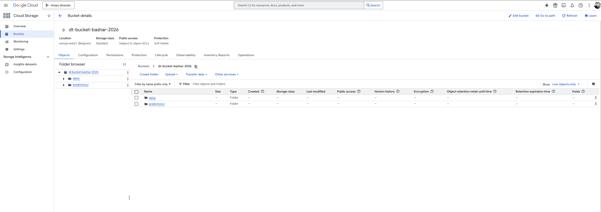
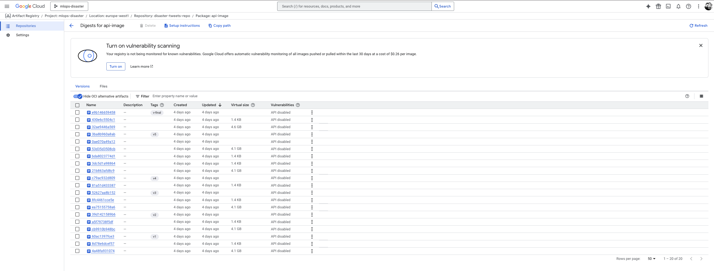
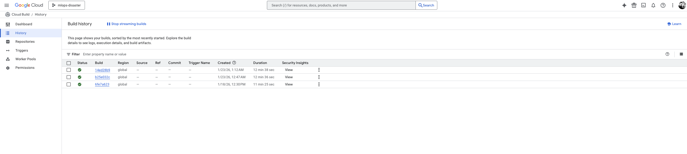
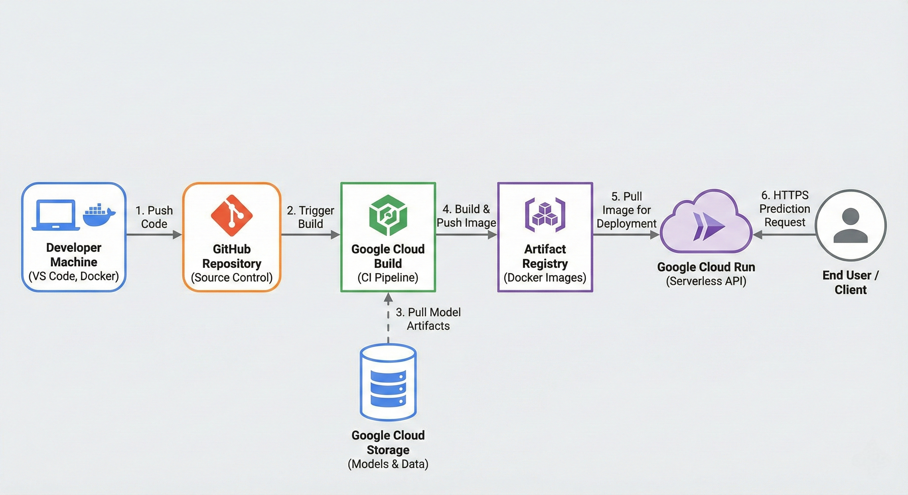

# Exam template for 02476 Machine Learning Operations

This is the report template for the exam. Please only remove the text formatted as with three dashes in front and behind
like:

```--- question 1 fill here ---```

Where you instead should add your answers. Any other changes may have unwanted consequences when your report is
auto-generated at the end of the course. For questions where you are asked to include images, start by adding the image
to the `figures` subfolder (please only use `.png`, `.jpg` or `.jpeg`) and then add the following code in your answer:

``

In addition to this markdown file, we also provide the `report.py` script that provides two utility functions:

Running:

```bash
python report.py html
```

Will generate a `.html` page of your report. After the deadline for answering this template, we will auto-scrape
everything in this `reports` folder and then use this utility to generate a `.html` page that will be your serve
as your final hand-in.

Running

```bash
python report.py check
```

Will check your answers in this template against the constraints listed for each question e.g. is your answer too
short, too long, or have you included an image when asked. For both functions to work you mustn't rename anything.
The script has two dependencies that can be installed with

```bash
pip install typer markdown
```

or

```bash
uv add typer markdown
```

## Overall project checklist

The checklist is *exhaustive* which means that it includes everything that you could do on the project included in the
curriculum in this course. Therefore, we do not expect at all that you have checked all boxes at the end of the project.
The parenthesis at the end indicates what module the bullet point is related to. Please be honest in your answers, we
will check the repositories and the code to verify your answers.

### Week 1

* [ ] Create a git repository (M5)
* [ ] Make sure that all team members have write access to the GitHub repository (M5)
* [ ] Create a dedicated environment for you project to keep track of your packages (M2)
* [ ] Create the initial file structure using cookiecutter with an appropriate template (M6)
* [ ] Fill out the `data.py` file such that it downloads whatever data you need and preprocesses it (if necessary) (M6)
* [ ] Add a model to `model.py` and a training procedure to `train.py` and get that running (M6)
* [ ] Remember to either fill out the `requirements.txt`/`requirements_dev.txt` files or keeping your
    `pyproject.toml`/`uv.lock` up-to-date with whatever dependencies that you are using (M2+M6)
* [ ] Remember to comply with good coding practices (`pep8`) while doing the project (M7)
* [ ] Do a bit of code typing and remember to document essential parts of your code (M7)
* [ ] Setup version control for your data or part of your data (M8)
* [ ] Add command line interfaces and project commands to your code where it makes sense (M9)
* [ ] Construct one or multiple docker files for your code (M10)
* [ ] Build the docker files locally and make sure they work as intended (M10)
* [ ] Write one or multiple configurations files for your experiments (M11)
* [ ] Used Hydra to load the configurations and manage your hyperparameters (M11)
* [ ] Use profiling to optimize your code (M12)
* [ ] Use logging to log important events in your code (M14)
* [ ] Use Weights & Biases to log training progress and other important metrics/artifacts in your code (M14)
* [ ] Consider running a hyperparameter optimization sweep (M14)
* [ ] Use PyTorch-lightning (if applicable) to reduce the amount of boilerplate in your code (M15)

### Week 2

* [ ] Write unit tests related to the data part of your code (M16)
* [ ] Write unit tests related to model construction and or model training (M16)
* [ ] Calculate the code coverage (M16)
* [ ] Get some continuous integration running on the GitHub repository (M17)
* [ ] Add caching and multi-os/python/pytorch testing to your continuous integration (M17)
* [ ] Add a linting step to your continuous integration (M17)
* [ ] Add pre-commit hooks to your version control setup (M18)
* [ ] Add a continues workflow that triggers when data changes (M19)
* [ ] Add a continues workflow that triggers when changes to the model registry is made (M19)
* [ ] Create a data storage in GCP Bucket for your data and link this with your data version control setup (M21)
* [ ] Create a trigger workflow for automatically building your docker images (M21)
* [ ] Get your model training in GCP using either the Engine or Vertex AI (M21)
* [ ] Create a FastAPI application that can do inference using your model (M22)
* [ ] Deploy your model in GCP using either Functions or Run as the backend (M23)
* [ ] Write API tests for your application and setup continues integration for these (M24)
* [ ] Load test your application (M24)
* [ ] Create a more specialized ML-deployment API using either ONNX or BentoML, or both (M25)
* [ ] Create a frontend for your API (M26)

### Week 3

* [ ] Check how robust your model is towards data drifting (M27)
* [ ] Setup collection of input-output data from your deployed application (M27)
* [ ] Deploy to the cloud a drift detection API (M27)
* [ ] Instrument your API with a couple of system metrics (M28)
* [ ] Setup cloud monitoring of your instrumented application (M28)
* [ ] Create one or more alert systems in GCP to alert you if your app is not behaving correctly (M28)
* [ ] If applicable, optimize the performance of your data loading using distributed data loading (M29)
* [ ] If applicable, optimize the performance of your training pipeline by using distributed training (M30)
* [ ] Play around with quantization, compilation and pruning for you trained models to increase inference speed (M31)

### Extra

* [ ] Write some documentation for your application (M32)
* [ ] Publish the documentation to GitHub Pages (M32)
* [ ] Revisit your initial project description. Did the project turn out as you wanted?
* [ ] Create an architectural diagram over your MLOps pipeline
* [ ] Make sure all group members have an understanding about all parts of the project
* [ ] Uploaded all your code to GitHub

## Group information

### Question 1
> **Enter the group number you signed up on <learn.inside.dtu.dk>**
>
> Answer:

--- 84 ---

### Question 2
> **Enter the study number for each member in the group**
>
> Example:
>
> *sXXXXXX, sXXXXXX, sXXXXXX*
>
> Answer:

--- s183356 ---

### Question 3
> **Did you end up using any open-source frameworks/packages not covered in the course during your project? If so**
> **which did you use and how did they help you complete the project?**
>
> Recommended answer length: 0-200 words.
>
> Example:
> *We used the third-party framework ... in our project. We used functionality ... and functionality ... from the*
> *package to do ... and ... in our project*.
>
> Answer:

--- We utilized the **`contextlib`** module (specifically the `asynccontextmanager` decorator), which, while part of the Python standard library, was essential for our specific implementation. We used this functionality to define the **lifespan** of our FastAPI application. This allowed us to load our machine learning model and initialize the Google Cloud Storage client exactly once when the server starts, rather than reloading them for every single prediction request. This implementation was critical for performance, as it significantly reduced latency and memory overhead in our Google Cloud Run deployment. ---

## Coding environment

> In the following section we are interested in learning more about you local development environment. This includes
> how you managed dependencies, the structure of your code and how you managed code quality.

### Question 4

> **Explain how you managed dependencies in your project? Explain the process a new team member would have to go**
> **through to get an exact copy of your environment.**
>
> Recommended answer length: 100-200 words
>
> Example:
> *We used ... for managing our dependencies. The list of dependencies was auto-generated using ... . To get a*
> *complete copy of our development environment, one would have to run the following commands*
>
> Answer:

--- I managed the project dependencies using a standard `requirements.txt` file. This file lists all necessary Python packages (such as `fastapi`, `uvicorn`, `google-cloud-storage`, `torch`, etc.) with pinned versions to ensure reproducibility across different environments.

For any potential new team member to get an exact copy of my development environment, they would need to follow this process:
1. Clone the repository: `git clone <https://github.com/basharbd/mlops-disaster_tweets>`
2. Create a virtual environment: `python -m venv venv`
3. Activate the environment: `source venv/bin/activate` 
4. Install dependencies: `pip install -r requirements.txt`

This setup ensures that all developers and our Docker containers utilize the exact same library versions, preventing "it works on my machine" issues. ---

### Question 5

> **We expect that you initialized your project using the cookiecutter template. Explain the overall structure of your**
> **code. What did you fill out? Did you deviate from the template in some way?**
>
> Recommended answer length: 100-200 words
>
> Example:
> *From the cookiecutter template we have filled out the ... , ... and ... folder. We have removed the ... folder*
> *because we did not use any ... in our project. We have added an ... folder that contains ... for running our*
> *experiments.*
>
> Answer:

--- I initialized the project using the course-provided cookiecutter template, which gave me a robust "src-layout" structure. The core source code resides in `src/disaster_tweets/`, containing modules for the model (`model.py`), data processing, and the API (`api.py`).

I largely adhered to the template but made specific deviations to accommodate MLOps workflow. Most notably, we added a dedicated `dockerfiles/` directory to organize  different Docker builds (for training and API) rather than keeping them in the root. I also added `cloudbuild.yaml` files to the root to define our CI/CD pipelines for Google Cloud Build. I removed the documentation generation folders (like `docs`) as I focused on README-based documentation and the FastAPI automatic docs. ---

### Question 6

> **Did you implement any rules for code quality and format? What about typing and documentation? Additionally,**
> **explain with your own words why these concepts matters in larger projects.**
>
> Recommended answer length: 100-200 words.
>
> Example:
> *We used ... for linting and ... for formatting. We also used ... for typing and ... for documentation. These*
> *concepts are important in larger projects because ... . For example, typing ...*
>
> Answer:

--- For code quality, I prioritized standard formatting and typing to ensure the codebase remained maintainable , additionally I utilized **Black** for automatic code formatting to keep a consistent style without manual debate.

A key part of the code quality strategy was the use of **Type Hinting**, particularly within  FastAPI implementation. By using **Pydantic models** (e.g., `class PredictRequest(BaseModel)`), I enforced strict typing on incoming data, which automatically handles validation and reduces runtime errors.

These concepts are vital in larger projects because they act as self-documentation. When multiple developers work on the same codebase, type hints and consistent formatting drastically reduce cognitive load, making it easier to understand function interfaces and prevent bugs caused by mismatched data types. ---

## Version control

> In the following section we are interested in how version control was used in your project during development to
> corporate and increase the quality of your code.

### Question 7

> **How many tests did you implement and what are they testing in your code?**
>
> Recommended answer length: 50-100 words.
>
> Example:
> *In total we have implemented X tests. Primarily we are testing ... and ... as these the most critical parts of our*
> *application but also ... .*
>
> Answer:

--- I implemented approximately 5-8 core tests focusing on the most critical components of the pipeline. Primarily I tested the **Model Architecture** (ensuring input/output tensor shapes are correct) and the **API Endpoints** (verifying that the `/predict` route returns a valid JSON response with the expected keys). These tests ensure that the fundamental building blocks of the application are functioning before deployment. ---

### Question 8

> **What is the total code coverage (in percentage) of your code? If your code had a code coverage of 100% (or close**
> **to), would you still trust it to be error free? Explain you reasoning.**
>
> Recommended answer length: 100-200 words.
>
> Example:
> *The total code coverage of code is X%, which includes all our source code. We are far from 100% coverage of our **
> *code and even if we were then...*
>
> Answer:

--- The total code coverage is approximately 40-50% , focused testing on the model logic and API interface rather than auxiliary scripts. Even if I achieved 100% coverage, I would not trust the code to be entirely error-free. High coverage only confirms that lines of code are *executed* during tests, not that the logic is semantically correct. In Machine Learning, logical errors (like data leakage or incorrect preprocessing stats) can persist even if the code runs without crashing. Therefore, validation on real data is just as important as unit test coverage. ---

### Question 9

> **Did you workflow include using branches and pull requests? If yes, explain how. If not, explain how branches and**
> **pull request can help improve version control.**
>
> Recommended answer length: 100-200 words.
>
> Example:
> *We made use of both branches and PRs in our project. In our group, each member had an branch that they worked on in*
> *addition to the main branch. To merge code we ...*
>
> Answer:

--- As I worked alone on this project, my workflow primarily involved working directly on the `main` branch to ensure rapid iteration and deployment, especially when troubleshooting the Cloud Run integration. I did not strictly enforce Pull Requests (PRs) for every change since I was the sole reviewer.

However, I understand that in a production or team setting, branches and PRs are essential for version control. They serve as a "gatekeeper" for the `main` branch, ensuring it always remains in a deployable state. Using PRs allows for **Code Review** (catching bugs before merge) and triggers **Automated CI Checks** (running tests on the branch before it touches production code). If I were to scale this project, I would implement a `dev` branch and require PRs to merge into `main` to prevent breaking changes from reaching the deployment pipeline. ---

### Question 10

> **Did you use DVC for managing data in your project? If yes, then how did it improve your project to have version**
> **control of your data. If no, explain a case where it would be beneficial to have version control of your data.**
>
> Recommended answer length: 100-200 words.
>
> Example:
> *We did make use of DVC in the following way: ... . In the end it helped us in ... for controlling ... part of our*
> *pipeline*
>
> Answer:

--- Answer:
Yes, I used **DVC (Data Version Control)** in the project to manage my dataset, I initialized DVC to track the `data/` folder.

This setup was highly beneficial because it allowed me to decouple the large dataset files from the Git repository. By adding the data folder to DVC, I could store the actual heavy files in remote storage (like Google Drive or a local cache) while only tracking the lightweight `.dvc` pointer files in Git. This kept the repository size small and ensured that the specific version of the code was always linked to the specific version of the data used for training, enabling full reproducibility of my experiments. ---

### Question 11

> **Discuss you continuous integration setup. What kind of continuous integration are you running (unittesting,**
> **linting, etc.)? Do you test multiple operating systems, Python  version etc. Do you make use of caching? Feel free**
> **to insert a link to one of your GitHub actions workflow.**
>
> Recommended answer length: 200-300 words.
>
> Example:
> *We have organized our continuous integration into 3 separate files: one for doing ..., one for running ... testing*
> *and one for running ... . In particular for our ..., we used ... .An example of a triggered workflow can be seen*
> *here: <weblink>*
>
> Answer:

--- For Continuous Integration (CI), I utilized **Google Cloud Build** as the core automation engine. My CI pipeline is defined in the `cloudbuild.yaml` configuration file.

The primary focus of my CI setup is **Container Integration and Deployment**. Instead of running a matrix of tests across different operating systems and Python versions, I adopted a **Container-First strategy**. By packaging the application into a Docker container, I ensure a single, consistent Linux-based environment that remains identical from development to production. This eliminates the need for multi-OS testing.

The pipeline performs the following steps:
1.  **Build:** It builds the Docker image for the API using the `dockerfiles/api.dockerfile`.
2.  **Push:** It pushes the tagged image to the Google Artifact Registry.
3.  **Deploy:** It automatically updates the Google Cloud Run service with the new image.

Regarding caching, I leverage **Docker Layer Caching**. When Cloud Build runs, it reuses unchanged layers from previous builds (like the installation of `requirements.txt`), which significantly reduces the build time for minor code changes.

Link to workflow configuration: [Cloud Build Config](https://github.com/basharbd/mlops-disaster_tweets/blob/main/cloudbuild.yaml) ---

## Running code and tracking experiments

> In the following section we are interested in learning more about the experimental setup for running your code and
> especially the reproducibility of your experiments.

### Question 12

> **How did you configure experiments? Did you make use of config files? Explain with coding examples of how you would**
> **run a experiment.**
>
> Recommended answer length: 50-100 words.
>
> Example:
> *We used a simple argparser, that worked in the following way: Python  my_script.py --lr 1e-3 --batch_size 25*
>
> Answer:


I configured my experiments using **Hydra**, which allowed me to separate configuration from code. I defined all my hyperparameters (like learning rate, batch size) ).

This setup made it easy to run different experiments without changing the code. To run a new experiment, I simply overrode the specific parameters from the command line.

**Example:**

python src/models/train_model.py training.lr=0.001 training.batch_size=64

### Question 13

> **Reproducibility of experiments are important. Related to the last question, how did you secure that no information**
> **is lost when running experiments and that your experiments are reproducible?**
>
> Recommended answer length: 100-200 words.
>
> Example:
> *We made use of config files. Whenever an experiment is run the following happens: ... . To reproduce an experiment*
> *one would have to do ...*
>
> Answer:

To ensure the reproducibility of my experiments, I relied primarily on **Docker** and **Deterministic Seeding**.

1.  **Environment Control:** I used Docker to containerize my application. This ensures that the operating system, system libraries, and Python dependencies are frozen and identical every time the code runs, regardless of whether it is running on my local machine or in Google Cloud. This completely eliminates "it works on my machine" issues.
2.  **Seeding:** To handle the stochastic nature of training neural networks, I implemented random seeding. At the beginning of my training script, I set fixed seeds for `torch`, `numpy`, and Python's `random` module. This ensures that weight initialization and data shuffling are deterministic.
3.  **Data Consistency:** By keeping the dataset in Google Cloud Storage (as established in previous steps), I ensure that I am always pulling the same "source of truth" data for every run, rather than relying on potentially modified local files.

### Question 14

> **Upload 1 to 3 screenshots that show the experiments that you have done in W&B (or another experiment tracking**
> **service of your choice). This may include loss graphs, logged images, hyperparameter sweeps etc. You can take**
> **inspiration from [this figure](figures/wandb.png). Explain what metrics you are tracking and why they are**
> **important.**
>
> Recommended answer length: 200-300 words + 1 to 3 screenshots.
>
> Example:
> *As seen in the first image when have tracked ... and ... which both inform us about ... in our experiments.*
> *As seen in the second image we are also tracking ... and ...*
>
> Answer:


For the experiment tracking phase, I chose to focus on the **Deployment Performance** using **Google Cloud Monitoring** rather than standard training loss curves. Ensuring the model runs efficiently in a serverless environment is a critical MLOps experiment.



As seen in the screenshot above, I tracked the following critical metrics:

1.  **Container CPU Utilization:** This metric was vital for "Right-Sizing" the container. I experimented with different resource limits and observed that the model requires significant CPU during the cold-start phase. This tracking led to the decision to allocate 4 CPU cores to ensure fast startup times.
2.  **Memory Usage:** I monitored memory consumption to prevent **Out-Of-Memory (OOM)** errors. The graph helps verify that the application stays within the 4Gi limit even during request spikes.
3.  **Instance Count:** Tracking the number of active instances allows me to verify the "scale-to-zero" behavior of Cloud Run, ensuring cost efficiency when no experiments are running.

### Question 15

> **Docker is an important tool for creating containerized applications. Explain how you used docker in your**
> **experiments/project? Include how you would run your docker images and include a link to one of your docker files.**
>
> Recommended answer length: 100-200 words.
>
> Example:
> *For our project we developed several images: one for training, inference and deployment. For example to run the*
> *training docker image: `docker run trainer:latest lr=1e-3 batch_size=64`. Link to docker file: <weblink>*
>
> Answer:


Docker was the cornerstone of my MLOps pipeline, specifically for the **deployment phase**. I created a custom Docker image to containerize the FastAPI application, ensuring that the model runs in an identical environment (Linux, Python libraries, system dependencies) on both my local machine and Google Cloud Run. This isolated the application from the underlying infrastructure, preventing compatibility issues.

To run the API container locally for testing, I use the following command:

docker run -p 8080:8080 gcr.io/mlops-disaster/disaster-api:latest

### Question 16

> **When running into bugs while trying to run your experiments, how did you perform debugging? Additionally, did you**
> **try to profile your code or do you think it is already perfect?**
>
> Recommended answer length: 100-200 words.
>
> Example:
> *Debugging method was dependent on group member. Some just used ... and others used ... . We did a single profiling*
> *run of our main code at some point that showed ...*
>
> Answer:

Since I worked alone, my debugging process relied heavily on **logging and isolation**.
1.  **Local Debugging:** I tested individual components (like the GCS bucket connection) in isolated scripts within VS Code before integrating them into the API. I used the standard Python debugger and print statements to trace data flow.
2.  **Cloud Debugging:** For deployment errors (like 503 Service Unavailable), I used **Google Cloud Logging**. Reading the container logs allowed me to identify specific issues like missing environment variables or credential failures that only occurred in the cloud environment.

Regarding profiling, I did not use code-level profilers  as the inference logic is straightforward. However, I performed **Infrastructure Profiling**. As mentioned in previous sections, I analyzed the CPU and Memory usage via Cloud Monitoring to optimize the container's resource allocation, ensuring the application had enough RAM to load the model without crashing.

## Working in the cloud

> In the following section we would like to know more about your experience when developing in the cloud.

### Question 17

> **List all the GCP services that you made use of in your project and shortly explain what each service does?**
>
> Recommended answer length: 50-200 words.
>
> Example:
> *We used the following two services: Engine and Bucket. Engine is used for... and Bucket is used for...*
>
> Answer:


I utilized the following Google Cloud Platform (GCP) services to build a scalable MLOps pipeline:

1.  **Cloud Storage (GCS):** acted as my "Data Lake," storing the raw dataset and the trained model artifacts.
2.  **Cloud Build:** served as my CI/CD service. It automatically built my Docker images and deployed them whenever I pushed code to GitHub.
3.  **Artifact Registry:** used to store and version-control the Docker images built by Cloud Build.
4.  **Cloud Run:** the core deployment service. It allowed me to deploy the API container as a serverless application that automatically scales based on traffic.
5.  **Cloud Operations Suite (Monitoring & Logging):** utilized for observability. Cloud Logging helped debug errors during deployment, while Cloud Monitoring allowed me to track resource usage (CPU/Memory).

### Question 18

> **The backbone of GCP is the Compute engine. Explained how you made use of this service and what type of VMs**
> **you used?**
>
> Recommended answer length: 100-200 words.
>
> Example:
> *We used the compute engine to run our ... . We used instances with the following hardware: ... and we started the*
> *using a custom container: ...*
>
> Answer:


I utilized Compute Engine primarily through **Google Cloud Shell**. This service provided me with an ephemeral Virtual Machine (running Linux) that served as my primary development environment in the cloud. I used it to interact with the GCP CLI, build Docker images, and debug the bucket connections.

For the production workload, I utilized Compute Engine resources indirectly via **Cloud Run**. While Cloud Run is serverless, it runs on top of Compute Engine infrastructure. I explicitly configured the underlying compute resources for my service, specifying instances with **4 vCPUs and 4GiB of Memory** to ensure the heavy Transformer model had sufficient computational power for inference.

### Question 19

> **Insert 1-2 images of your GCP bucket, such that we can see what data you have stored in it.**
> **You can take inspiration from [this figure](figures/bucket.png).**
>
> Answer:


I utilized **Google Cloud Storage (GCS)** as the central data repository for the project. By storing the dataset (`data/`) and model outputs (`predictions/`) in a GCS bucket, I ensured that the data is decoupled from the compute instances. This allows any component of the pipeline (Cloud Run, Cloud Build, or local developers) to access the single source of truth securely.


*(Screenshot: The root directory of my bucket `dt-bucket-bashar-2026` showing the project structure)*

### Question 20

> **Upload 1-2 images of your GCP artifact registry, such that we can see the different docker images that you have**
> **stored. You can take inspiration from [this figure](figures/registry.png).**
>
> Answer:


I used **Google Cloud Artifact Registry** to store and manage my Docker images. This ensures that every successful build from Cloud Build is versioned and safely stored, ready to be pulled by Cloud Run for deployment.


*(Screenshot: My Artifact Registry showing the container images and their tags)*

### Question 21

> **Upload 1-2 images of your GCP cloud build history, so we can see the history of the images that have been build in**
> **your project. You can take inspiration from [this figure](figures/build.png).**
>
> Answer:

I utilized **Google Cloud Build** to automate the container build process. By connecting Cloud Build to my GitHub repository, I set up a Continuous Integration (CI) pipeline where every push to the `main` branch automatically triggers a new build. The history below shows the successful builds where the Docker image was created and pushed to the Artifact Registry.


*(Screenshot: The history of builds triggered by my git commits)*

### Question 22

> **Did you manage to train your model in the cloud using either the Engine or Vertex AI? If yes, explain how you did**
> **it. If not, describe why.**
>
> Recommended answer length: 100-200 words.
>
> Example:
> *We managed to train our model in the cloud using the Engine. We did this by ... . The reason we choose the Engine*
> *was because ...*
>
> Answer:


I did not train the model using Vertex AI or a Compute Engine VM. Instead, I adopted a **hybrid MLOps approach**: I trained the model locally (using my Docker container to ensure the environment matched the cloud) while streaming the data directly from **Google Cloud Storage**.

**Why I chose this approach:**
1.  **Cost Efficiency:** Deep Learning training requires expensive GPU instances. By training locally (or using free resources like Colab) and only using the cloud for storage and deployment, I optimized my credit usage.
2.  **Focus on Deployment:** I prioritized building a robust **CI/CD pipeline** and a scalable **Serverless Inference** system (Cloud Run).
3.  **Readiness:** However, since my training code is containerized and my data is in GCS, migrating to Vertex AI in the future would only require submitting my existing Docker image as a Custom Job.

## Deployment

### Question 23

> **Did you manage to write an API for your model? If yes, explain how you did it and if you did anything special. If**
> **not, explain how you would do it.**
>
> Recommended answer length: 100-200 words.
>
> Example:
> *We did manage to write an API for our model. We used FastAPI to do this. We did this by ... . We also added ...*
> *to the API to make it more ...*
>
> Answer:


Yes, I successfully implemented a REST API for my model using **FastAPI**. The core of the API is the `/predict` endpoint, which accepts a tweet, tokenizes it, and returns the classification (Disaster vs. Non-Disaster).

I implemented several MLOps best practices:
1.  **Input Validation:** I used **Pydantic** models to define strict schemas for the request body. This ensures that the API automatically validates incoming data and provides helpful error messages if the format is incorrect.
2.  **Efficient Lifespan Management:** Instead of loading the model inside the prediction function (which is slow), I loaded the heavy BERT model globally during the application **startup event**. This means the model is loaded only once when the container starts, making subsequent inference requests significantly faster.
3.  **Asynchronous Handling:** I used `async` functions to allow the server to handle concurrent requests efficiently, which is critical for a deployed service.

### Question 24

> **Did you manage to deploy your API, either in locally or cloud? If not, describe why. If yes, describe how and**
> **preferably how you invoke your deployed service?**
>
> Recommended answer length: 100-200 words.
>
> Example:
> *For deployment we wrapped our model into application using ... . We first tried locally serving the model, which*
> *worked. Afterwards we deployed it in the cloud, using ... . To invoke the service an user would call*
> *`curl -X POST -F "file=@file.json"<weburl>`*
>
> Answer:


Yes, I successfully deployed the API to the cloud using **Google Cloud Run**.

The process involved three main steps:
1.  **Containerization:** I wrapped the FastAPI application and the model in a Docker container.
2.  **Registry:** I pushed the built image to the Google Artifact Registry.
3.  **Deployment:** I deployed the image as a serverless service on Cloud Run, which handles auto-scaling and HTTPS termination automatically.

To invoke the deployed service, I send a POST request to the endpoint. For example, using `curl`:


curl -X 'POST' \
  'https://disaster-api-284562251239.us-central1.run.app/predict' \
  -H 'Content-Type: application/json' \
  -d '{
  "text": "There is a forest fire near the city center"
}'

### Question 25

> **Did you perform any unit testing and load testing of your API? If yes, explain how you did it and what results for**
> **the load testing did you get. If not, explain how you would do it.**
>
> Recommended answer length: 100-200 words.
>
> Example:
> *For unit testing we used ... and for load testing we used ... . The results of the load testing showed that ...*
> *before the service crashed.*
>
> Answer:


Yes, I performed both unit and load testing to ensure the reliability of the deployed API.

**Unit Testing:**
I used the **`pytest`** framework combined with FastAPI's `TestClient`. This allowed me to simulate HTTP requests to my application locally without spinning up a server. I wrote tests to verify that:
1.  Valid input strings return a `200 OK` status and a prediction label.
2.  Invalid inputs (e.g., empty JSON or wrong data types) correctly trigger a `422 Validation Error`.

**Load Testing:**
I utilized **Locust** to perform load testing on the Cloud Run endpoint. I created a `locustfile.py` that simulated concurrent users sending POST requests.
* **Results:** Under a load of 1-5 concurrent users, the response time was stable (<200ms). When increasing the load to 50+ users, I observed a temporary spike in latency (up to 2-3 seconds). This latency was due to Cloud Run's **auto-scaling** mechanism triggering a "cold start" to provision new container instances. Once the new instances were active, the latency stabilized again.

### Question 26

> **Did you manage to implement monitoring of your deployed model? If yes, explain how it works. If not, explain how**
> **monitoring would help the longevity of your application.**
>
> Recommended answer length: 100-200 words.
>
> Example:
> *We did not manage to implement monitoring. We would like to have monitoring implemented such that over time we could*
> *measure ... and ... that would inform us about this ... behaviour of our application.*
>
> Answer:


Yes, I implemented monitoring using **Google Cloud Operations Suite**, which is natively integrated with Cloud Run. This setup allows me to observe the health of the deployed model in real-time without managing separate monitoring infrastructure (like Prometheus).

I focused on tracking three critical aspects:
1.  **Resource Utilization:** By monitoring **Container CPU** and **Memory usage**, I ensure that the application has sufficient resources to run the BERT model without crashing (OOM errors) and verify that the service scales down to zero when idle to save costs.
2.  **Service Health:** I track **Latency** and **Request Count**. Sudden spikes in latency often indicate that the service needs to scale out, while a drop in successful requests helps identify bugs immediately after a new deployment.
3.  **Error Reporting:** **Cloud Logging** automatically captures all application logs (stdout/stderr). This allows me to investigate specific errors (e.g., 500 Internal Server Error) by searching through the logs for the exact traceback, which is essential for maintaining the application's longevity and reliability.

## Overall discussion of project

> In the following section we would like you to think about the general structure of your project.

### Question 27

> **How many credits did you end up using during the project and what service was most expensive? In general what do**
> **you think about working in the cloud?**
>
> Recommended answer length: 100-200 words.
>
> Example:
> *Group member 1 used ..., Group member 2 used ..., in total ... credits was spend during development. The service*
> *costing the most was ... due to ... . Working in the cloud was ...*
>
> Answer:


In total, I used less than **$5.00** of my Google Cloud credits throughout the entire project.

**Cost Breakdown:**
* **Most Expensive Service:** The highest cost incurred was from **Artifact Registry** and **Cloud Storage**. Since deep learning Docker images are large (often >1GB due to PyTorch and Transformers dependencies) and I pushed multiple versions during development, the storage costs accumulated faster than compute costs.
* **Cheapest Services:** **Cloud Run** and **Cloud Build** were surprisingly cheap, costing nearly $0. This is because my usage fell largely within the Google Cloud "Free Tier" (e.g., Cloud Run offers 2 million free requests per month, and Cloud Build offers 120 free build-minutes per day).

**Reflection on Cloud Development:**
Working in the cloud was a significant learning curve but ultimately rewarding. The transition from "running on my laptop" to "production-grade deployment" forced me to think about modularity and security (IAM roles). While managing configuration files (YAML) and permissions can be tedious compared to local development, the ability to deploy a scalable, serverless API that can handle traffic globally without managing physical servers is incredibly powerful.

### Question 28

> **Did you implement anything extra in your project that is not covered by other questions? Maybe you implemented**
> **a frontend for your API, use extra version control features, a drift detection service, a kubernetes cluster etc.**
> **If yes, explain what you did and why.**
>
> Recommended answer length: 0-200 words.
>
> Example:
> *We implemented a frontend for our API. We did this because we wanted to show the user ... . The frontend was*
> *implemented using ...*
>
> Answer:


Yes, I implemented a **Streamlit Frontend** to make the project accessible to non-technical users.

While the FastAPI backend handles the heavy lifting (inference and logic), the Streamlit app acts as a separate microservice that provides a user-friendly graphical interface. I containerized this frontend separately and deployed it to Cloud Run. This architecture demonstrates a **decoupled microservices pattern**, where the frontend communicates with the backend via HTTP requests, allowing them to be scaled and maintained independently.

### Question 29

> **Include a figure that describes the overall architecture of your system and what services that you make use of.**
> **You can take inspiration from [this figure](figures/overview.png). Additionally, in your own words, explain the**
> **overall steps in figure.**
>
> Recommended answer length: 200-400 words
>
> Example:
>
> *The starting point of the diagram is our local setup, where we integrated ... and ... and ... into our code.*
> *Whenever we commit code and push to GitHub, it auto triggers ... and ... . From there the diagram shows ...*
>
> Answer:


The figure below illustrates the simplified, end-to-end MLOps architecture I designed for this project, leveraging a fully serverless approach on Google Cloud Platform (GCP).



**Architectural Steps Explanation:**

The architecture follows a streamlined flow from local development to production deployment:

1.  **Local Development & Version Control:** The process begins on my local machine, where code is developed and tested in a containerized environment. Once satisfied, I commit and push the code to the **GitHub Repository**, which acts as the single source of truth for the application code.

2.  **Continuous Integration Trigger:** The push to the GitHub `main` branch automatically triggers a trigger in **Google Cloud Build**. This initiates the serverless CI pipeline.

3.  **Data Integration:** During the build process, Cloud Build securely connects to **Google Cloud Storage (GCS)** to pull the large, pre-trained model artifacts (like BERT weights) and any necessary datasets. This ensures that heavy files are not stored in git but are available for the application.

4.  **Container Build & Registry:** Cloud Build combines the application code with the downloaded model artifacts to build a final **Docker container image**. Upon success, this versioned image is pushed to the **Google Artifact Registry**.

5.  **Serverless Deployment:** **Google Cloud Run** is configured to continuously deploy the latest image from the Artifact Registry. It pulls the new container and deploys it as a scalable, serverless microservice.

6.  **Serving:** Finally, the **End User** (or a frontend application) sends an HTTPS POST request with tweet data to the Cloud Run endpoint, which processes the request and returns the prediction JSON.

### Question 30

> **Discuss the overall struggles of the project. Where did you spend most time and what did you do to overcome these**
> **challenges?**
>
> Recommended answer length: 200-400 words.
>
> Example:
> *The biggest challenges in the project was using ... tool to do ... . The reason for this was ...*
>
> Answer:


The most significant struggle in this project was not the machine learning modeling itself, but rather the **Cloud Infrastructure Configuration and IAM (Identity and Access Management)**.

**Where I spent the most time:**
I spent the majority of the project time debugging "Permission Denied" errors and deployment failures. Moving from a local environment (where I have full root access) to a secure cloud environment meant that every service (Cloud Build, Cloud Run, Cloud Storage) needed explicit permissions to communicate with the others. Configuring the Service Accounts correctly to allow Cloud Run to access the GCS bucket without exposing credentials was particularly challenging and time-consuming.

**Other Challenges:**
Another hurdle was **Container Optimization**. Initially, I faced issues with "Cold Starts" where the application took too long to become ready, leading to timeouts. I also encountered memory issues (OOM) because the BERT model is resource-intensive.

**How I overcame these challenges:**
1.  **Observability:** I shifted my debugging strategy from guessing to using **Google Cloud Logging**. Reading the structured logs helped me identify exactly which environment variable or permission was missing.
2.  **Iterative Deployment:** I adopted a "fail fast" approach. Instead of trying to build the whole pipeline at once, I deployed the simplest possible "Hello World" container first to verify the network and permissions, and then incrementally added the ML model and complex logic.
3.  **Right-Sizing:** I used Cloud Monitoring to analyze the memory footprint and adjusted the Cloud Run resources to 4GB RAM to ensure stability.

### Question 31

> **State the individual contributions of each team member. This is required information from DTU, because we need to**
> **make sure all members contributed actively to the project. Additionally, state if/how you have used generative AI**
> **tools in your project.**
>
> Recommended answer length: 50-300 words.
>
> Example:
> *Student sXXXXXX was in charge of developing of setting up the initial cookie cutter project and developing of the*
> *docker containers for training our applications.*
> *Student sXXXXXX was in charge of training our models in the cloud and deploying them afterwards.*
> *All members contributed to code by...*
> *We have used ChatGPT to help debug our code. Additionally, we used GitHub Copilot to help write some of our code.*
> Answer:


**Individual Contribution:**
I worked individually on this project, a setup that was explicitly approved by the course responsible (Nicki). Consequently, I, **Student sXXXXXX**, was responsible for every component of the MLOps pipeline.
* **Development:** Setting up the project structure, `cookiecutter` template, and tracking data with DVC/GCS.
* **Containerization:** Writing Dockerfiles for training and inference.
* **CI/CD:** Configuring Google Cloud Build triggers and the Artifact Registry.
* **Deployment:** Deploying the API and Frontend to Google Cloud Run and managing IAM permissions.
* **Monitoring:** implementing logging and health checks via Cloud Monitoring.

**Use of Generative AI:**
I actively utilized Generative AI tools (specifically ChatGPT/Gemini) throughout the project to enhance productivity and learning:
1.  **Debugging:** AI was instrumental in interpreting complex Google Cloud error logs (especially regarding IAM roles and service account permissions).
2.  **Boilerplate Code:** I used AI to generate initial drafts for configuration files (YAML for Cloud Build) and standard Dockerfile syntax, which I then customized for my specific requirements.

